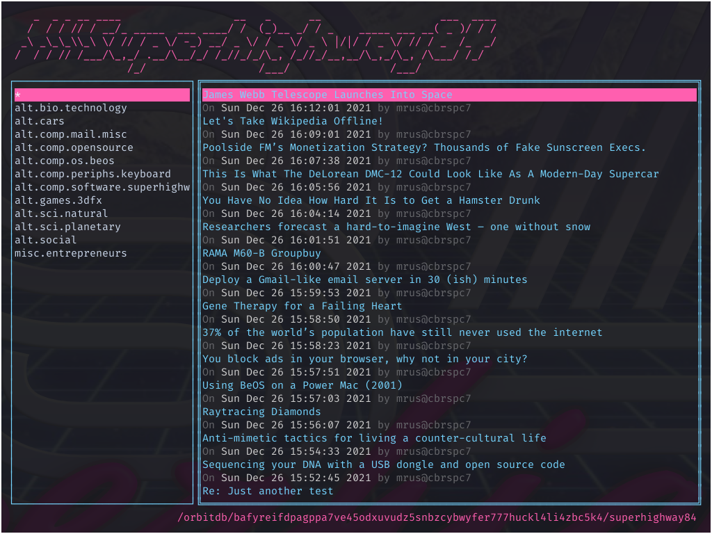

[](superhighway84.png)

```
===============================================================================
                       INTERACTIVE ASYNC / FULL DUPLEX
===============================================================================

                            Dial Up To 19.2 Kbps
                                  
                                   with

    _  _ _ __ ____                  __   _      __                   ___  ____
   /  / / // / __/_ _____  ___ ____/ /  (_)__ _/ / _    _____ ___ __( _ )/ / /
  _\ _\_\_\\_\ \/ // / _ \/ -_) __/ _ \/ / _ \/ _ \ |/|/ / _ \/ // / _  /_  _/
 /  / / // /___/\_,_/ .__/\__/_/ /_//_/_/\_, /_//_/__,__/\_,_/\_, /\___/ /_/
                   /_/                  /___/                /___/


       ::: USENET-INSPIRED DECENTRALIZED INTERNET DISCUSSION SYSTEM :::


  The V.H.S. (Very High Speed) Superhighway84 platform is more than just the
fastest decentralized, usenet-inspired communications platform available. It is
 also the first one to be based on the latest IPFS technology available today!

    Superhighway84 offers the most spectacular features under the Spectrum.
                                       
                             100% Error Protection
                         Data and Character Compression
                         Alternate Bell Compatible Mode
                         Long Haul Satellite Operation
                              Network Diagnostics
                                 Fallback Mode
                                    And More!


      The Superhighway84 modern decentralized internet discussion system.
                         It should cost a lot more than $0.


```



```

INSTALLATION
------------

Clone this repository and run:

$ go build .

The binary will be available at ./superhighway84 and can be moved wherever you
please.

If you don't have IPFS installed already, make sure to do so in order to be able
to initialize your IPFS repository:

https://docs.ipfs.io/install/command-line/

The IPFS repository can be initialized using the following command:

$ ipfs init


RUNNING
-------

First, check ulimit -n and verify that it's at a reasonable amount. IPFS
requires it to be large enough (>= 2048) in order to work properly over time.

Afterwards you can simply launch the binary:

$ ./superhighway84

A setup wizard will help you with initial configuration. Please make sure to
have at least HOME and EDITOR exported in your environment.

In case you would like to use a dedicated ipfs repository for Superhighway84,
you will have to export a different IPFS_PATH and make sure it was initialized
beforehand:

$ export IPFS_PATH=~/.ipfs-sh84
$ ipfs init
$ superhighway84

In case you're intending to run the official IPFS daemon and Superhighway84 in
parallel, be sure to adjust the ports in their respective IPFS repos (e.g.
~/.ipfs and ~/.ipfs-sh84) so that they won't utilize the same port numbers.
The ports 4001, 5001 and 8080 are relevant and should be adjusted to something
other for every new repo/IPFS node that will run in parallel, e.g.:

  "Addresses": {
    "Swarm": [
      "/ip4/0.0.0.0/tcp/4002",
      "/ip6/::/tcp/4002",
      "/ip4/0.0.0.0/udp/4002/quic",
      "/ip6/::/udp/4002/quic"
    ],
    "Announce": [],
    "NoAnnounce": [],
    "API": "/ip4/127.0.0.1/tcp/5002",
    "Gateway": "/ip4/127.0.0.1/tcp/8081"
  },

NOTE: When running Superhighway84 for the first time it might seem like it's
"hanging" at the command prompt. Usually it isn't hanging but rather searching
for peer it can connect to in order to synchronize the database. Depending on
how many people are online, this process might take _some time_, please be
patient.


USAGE
-----

Keyboard shortcuts:

- C-R: Refresh
- C-H: Focus groups list
- C-L: Focus articles list
- C-Q: Quit
-   K: Move up in list
-   J: Move down in list
-   H: Move left in list
-   L: Move right in list
-  CR: Select item in list
-   N: Publish new article
-   R: Reply to selected article


KNOWN LIMITATIONS
-----------------

- The OrbitDB that Superhighway84 uses is a public database, meaning everyone
  can alter its data. Since its using a standard _docstore_, PUT and DELETE
  events can alter existing data. This issue will be solved in the future by
  customizing the store to ignore these types of events.

- Probably plenty more that have yet to been found...


CREDITS
-------

- Superhighway84 name, code and graphics by mrusme
  https://github.com/mrusme

- Logo backdrop by Swift
  https://twitter.com/Swift_1_2/status/1114865117533888512

```

